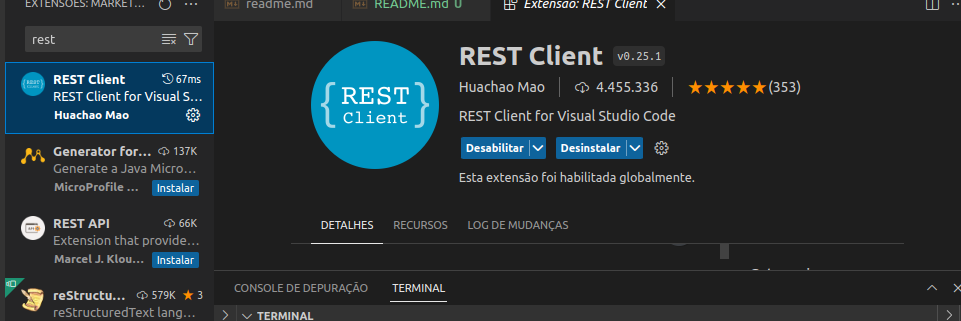
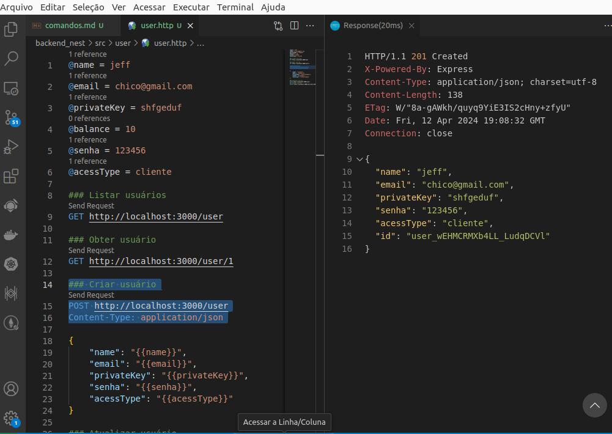
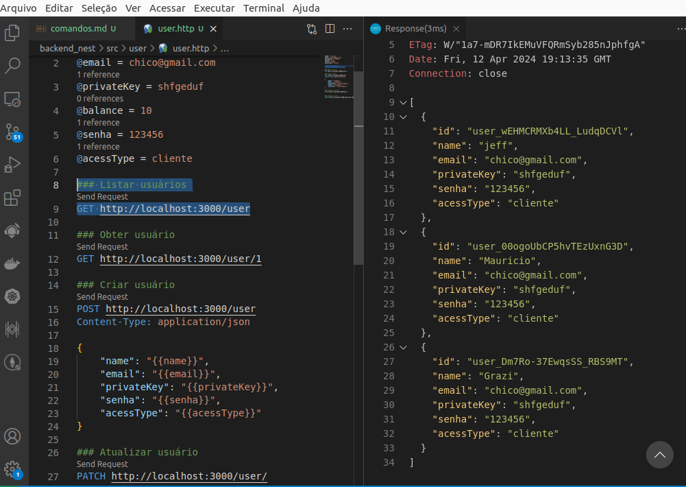
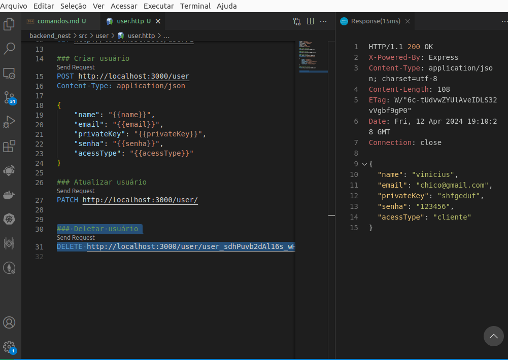

<p align="center">
  <a href="http://nestjs.com/" target="blank"></a>
</p>

[circleci-image]: https://img.shields.io/circleci/build/github/nestjs/nest/master?token=abc123def456
[circleci-url]: https://circleci.com/gh/nestjs/nest

  <p align="center">A progressive <a href="http://nodejs.org" target="_blank">Node.js</a> framework for building efficient and scalable server-side applications.</p>
    <p align="center">
<a href="https://www.npmjs.com/~nestjscore" target="_blank"></a>
<a href="https://www.npmjs.com/~nestjscore" target="_blank"></a>
<a href="https://www.npmjs.com/~nestjscore" target="_blank"></a>
<a href="https://circleci.com/gh/nestjs/nest" target="_blank"></a>
<a href="https://coveralls.io/github/nestjs/nest?branch=master" target="_blank"></a>
<a href="https://discord.gg/G7Qnnhy" target="_blank"></a>
<a href="https://opencollective.com/nest#backer" target="_blank"></a>
<a href="https://opencollective.com/nest#sponsor" target="_blank"></a>
  <a href="https://paypal.me/kamilmysliwiec" target="_blank"></a>
    <a href="https://opencollective.com/nest#sponsor"  target="_blank"></a>
  <a href="https://twitter.com/nestframework" target="_blank"></a>
</p>
  <!--[](https://opencollective.com/nest#backer)
  [](https://opencollective.com/nest#sponsor)-->


 # ✅ Backend Nest.js - Integração com Banco de Dados

Este projeto demonstra a integração do Nest.js com um banco de dados usando o TypeORM e SQLite.

## 📂  Inicialização do Nest

Para iniciar um novo projeto Nest, execute o seguinte comando:

```bash
npx @nestjs/cli new NOME_DA_PASTA
```
## ⚙️  Configurações para Banco de Dados

Instale as dependências necessárias:
```bash
npm i nanoid@3 sqlite3 typeorm @nestjs/typeorm class-validator class-transformer
```
## 🛠️ Criação de Instancia

Para criar uma nova tabela, execute o seguinte comando:
```bash
nest g resource NOME_DA_TABELA
```
Na pasta src, será criada uma pasta para a tabela.

## ✔️ Inicialização do Nest

Para iniciar o servidor, utilize o comando:

```bash
npm run start:dev

```
## ✔️ Extensões do VS Code

REST Client - Huachao Mao: Com esta extensão, você pode acessar diretamente os endpoints e ver as respostas das solicitações HTTP.



## ✔️ Adicionar Colunas 

Dentro de .src/user/dto/create-user.dto.ts, crie as colunas da tabela com @Annotation de verificação.
```bash
export class CreateUserDto {
  @IsString()
  name: string;

  @IsEmail()
  email: string;

  @IsString()
  privateKey: string;

  @IsString()
  senha: string;

  @IsString()
  acessType: string;
}


```


## ✔️ Habilitar Verificação da Tabela

Dentro de .src/main.ts, adicione o seguinte trecho de código:

```bash

async function bootstrap() {
  const app = await NestFactory.create(AppModule);
  app.useGlobalPipes(
    new ValidationPipe({
      transform: true,
      whitelist: true,
    }),
  );
  await app.listen(3000);
}
bootstrap();


```
`OBS: app.useglobalPipes foi adicionado para habilitar verificação da tabela pelos annotation's.`

## ⚙️ Conexão TypeORM

Dentro de .src/app.modules.ts, adicione o seguinte trecho de código:
```bash

@Module({
  imports: [
    TypeOrmModule.forRoot({
      type: 'sqlite',
      database: 'db.marketplace',
      entities: [__dirname + '/**/*.entity{.ts,.js}'],
      synchronize: true,
    }),
    UserModule,
  ],
  controllers: [AppController],
  providers: [AppService],
})
export class AppModule {}

```


Dentro de .src/user/user.modules.ts, adicione o seguinte trecho de código:

```bash

@@Module({
  imports: [TypeOrmModule.forFeature([User])],
  controllers: [UserController],
  providers: [UserService],
})
export class UserModule {}

```
##  ⚙️ Adicionando Entities no Banco de Dados

Dentro de .src/user/entities/user.entity.ts, adicione o seguinte trecho de código:

import { BeforeInsert, Column, Entity, PrimaryColumn } from 'typeorm';
import { nanoid } from 'nanoid';

```bash
@Entity('users')
export class user {
  @PrimaryColumn()
  id: string;

  @Column()
  name: string;

  @Column()
  email: string;

  @Column()
  privateKey: string;

  @Column()
  senha: string;

  @Column()
  acessType: string;

  @BeforeInsert()
  generateId() {
    this.id = `user_${nanoid()}`;
  }
}
```
## ⚙️ Modificando o User Service
Dentro de .src/user/user.service.ts, adicione o seguinte trecho de código:

```bash
import { Injectable } from '@nestjs/common';
import { CreateUserDto } from './dto/create-user.dto';
import { UpdateUserDto } from './dto/update-user.dto';
import { User } from './entities/user.entity';
import { Repository } from 'typeorm';
import { InjectRepository } from '@nestjs/typeorm';

@Injectable()
export class UserService {
  constructor(
    @InjectRepository(User)
    private readonly repository: Repository<User>,
  ) {}

  create(dto: CreateUserDto) {
    const user = this.repository.create(dto);
    return this.repository.save(user);
  }

  findAll() {
    return this.repository.find();
  }

  async findOne(id: string) {
    return this.repository.findOne({ where: { id } });
  }

  async update(id: string, dto: UpdateUserDto) {
    const user = await this.repository.findOne({ where: { id } });
    if (!user) return null;
    this.repository.merge(user, dto);
    return this.repository.save(user);
  }

  async remove(id: string) {
    const user = await this.repository.findOne({ where: { id } });
    if (!user) return null;
    return this.repository.remove(user);
  }
}


```
## ✅ Realizando chamadas:

Dentro de .src/user/user.http faça as chamadas utilizando a extensão REST Client (à direita):

### Executando POST:



### Executando GET:



### Executando DELETE:



Esse arquivo README.md contém todas as instruções necessárias para configurar e executar o projeto Nest.js com integração ao banco de dados. Certifique-se de substituir as seções relevantes com os detalhes específicos do seu projeto antes de usar.
